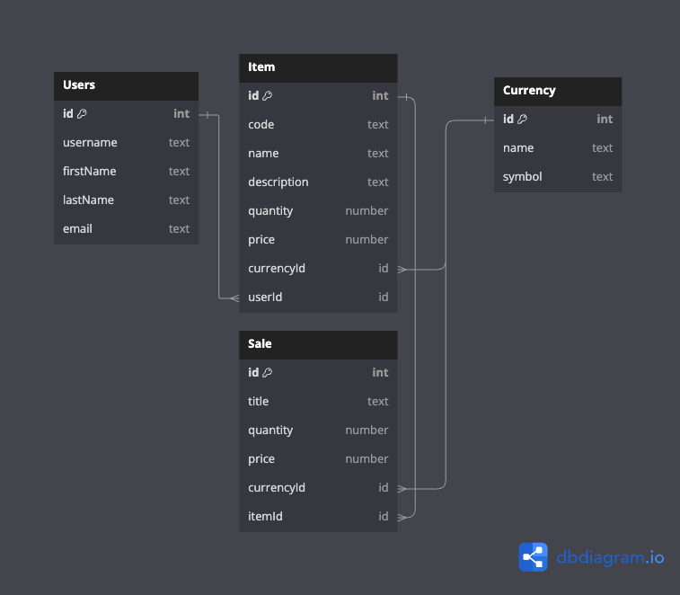

# Inventory Sync

## Features (MVP)

1. Add Item
   -  **Structure:**
      -  Code
      -  Name
      -  Description
      -  Quantity
      -  Price for each
      -  Pictures (maybe)
   -  [x] UI
   -  [x] Frontend State management
   -  [x] Backend
1. Currency
   -  _Configurable in settings_
   -  id (primary - default field)
   -  symbol
   -  name
1. View item
   -  [x] UI
   -  [x] Frontend State management
   -  [x] Backend
1. View items
   -  [x] UI
   -  [ ] UI - Filter data using available filter tools
   -  [x] Frontend State management
   -  [x] Backend
1. Manage items
   -  Edit (all the fields)
      -  [x] UI
      -  [x] Frontend State management
      -  [x] Backend
   -  Delete
      -  [x] UI
      -  [x] Frontend State management
      -  [x] Backend
   -  Update quantity when there is a sale (this would done through **Make Sale** page)
      -  [x] Frontend State management
      -  [x] Backend
1. See all Sales
   -  **Structure:**
      -  Item sold
      -  Title
      -  Quantity
      -  Price sold
      -  Sale date
   -  [x] UI
   -  [ ] UI - Filter data using available filter tools
   -  [x] Frontend State management
   -  [x] Backend
1. Make Sale
   -  [x] UI
   -  [x] Frontend State management
   -  [x] Backend
1. Auth - NextAuth
   -  [x] UI
   -  [x] Frontend State management
   -  [x] Backend

## Terminologies

1. **Item:** single item or product
2. **Stock:** inventory, a group of items - using stock because its short and easier to understand

## Database Structure

<kbd>

</kbd>
